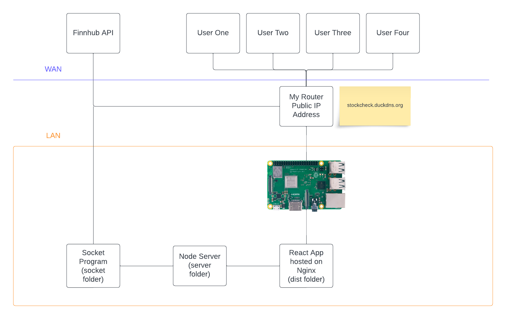
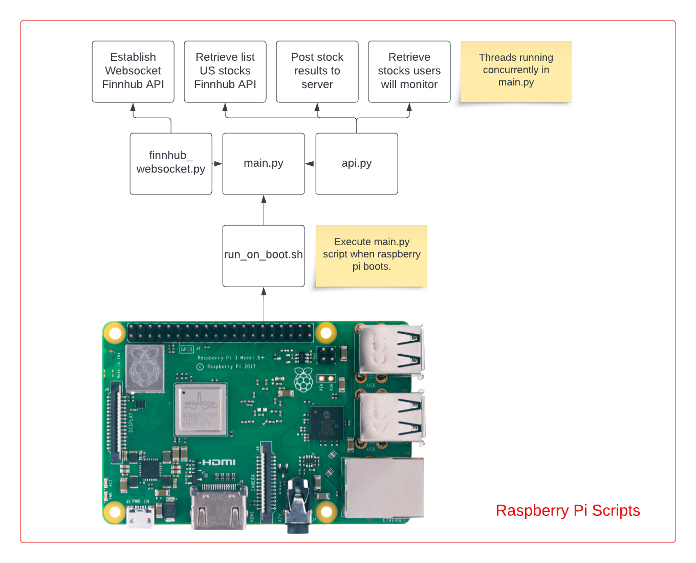
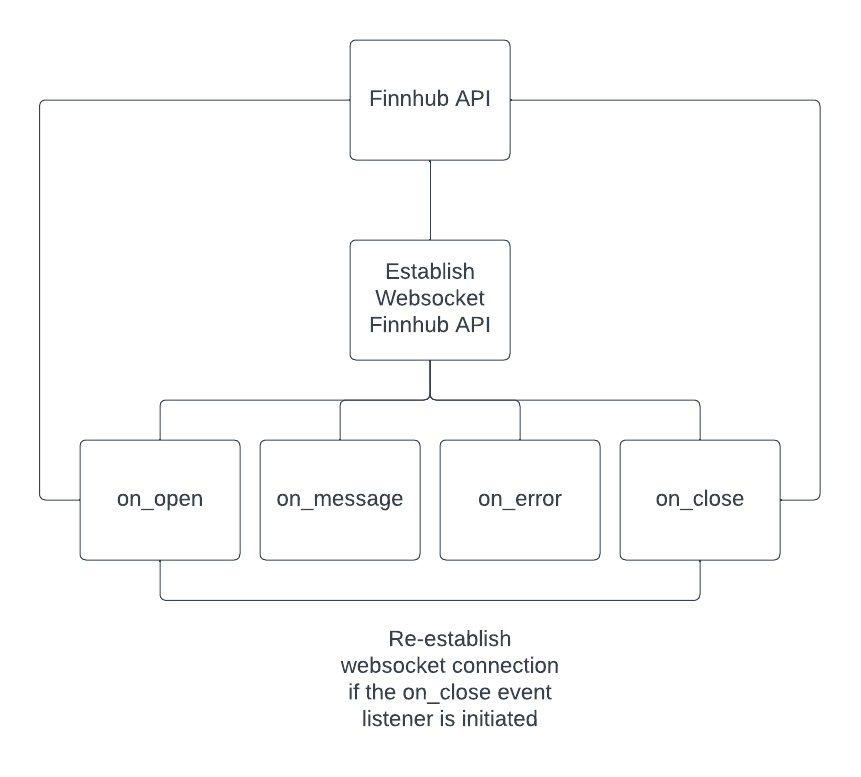
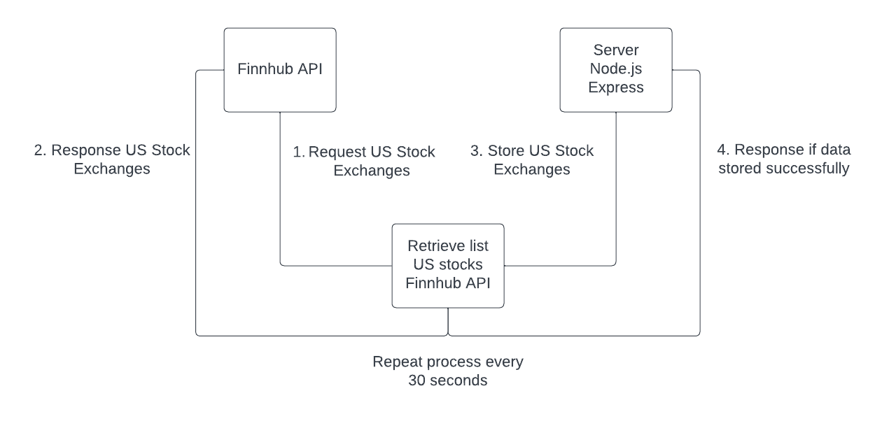
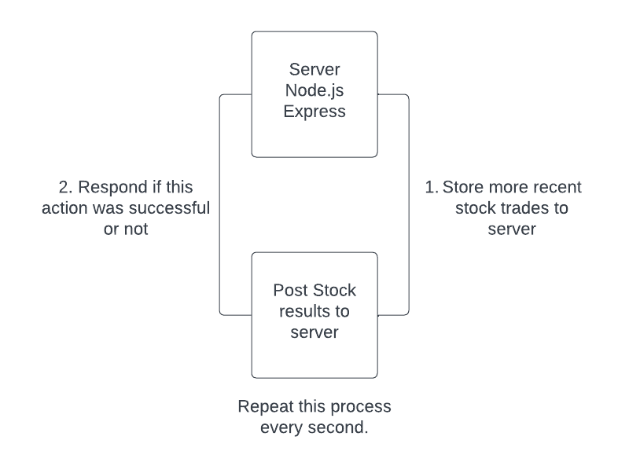
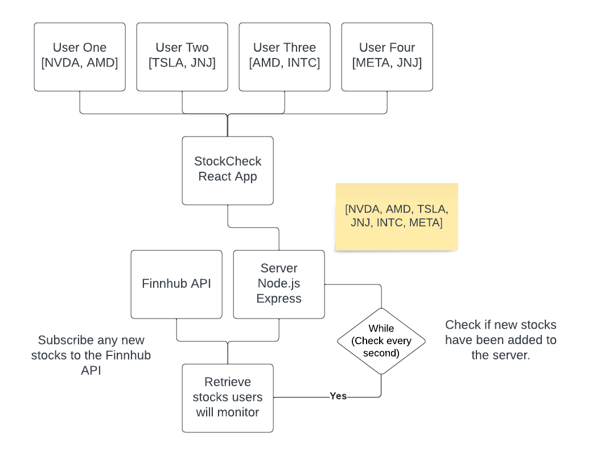

# StockCheck
### System Design
* User enters stockcheck.duckdns.org in their web browser.
* An HTTPS request over the wide area network (WAN) is sent to my router, and I forward the request to the raspberry pi in my local area network (LAN).
* SSL/TLS certificates used for HTTPS requests are managed through Let's Encrypt certificate authority.
* Nginx is used as both a web and reverse proxy server.  It will serve front-end static files created in react to users and communicate with the backend server to GET/POST data.
* Real-time stock trades are stored in the node server. A database was not used due to the storage limitations in the raspberry pi.
* Socket program (written in python) establishes a websocket connection to the Finnhub API and retrieves real-time stock data that users want to monitor. The information is stored in the node server.

  

### Script main.py (socket folder)
* Entry point for the program.
* Four of the following threads (tasks) run concurrently together: establish websocket connection to Finnhub API, retrieve US stocks list from Finnhub API, post real-time stock information to node server, and retrieve stocks users want to monitor from the frontend application StockCheck.

  

### Establish Websocket Finnhub API (Main Thread)
* on_open - Establishes bilateral communication to the Finnhub API.
* on_message - Retrieves last stock trade information for stocks we subscribe to the Finnhub API.
* on_error - Displays any error messages that happens with bilateral websocket communication.
* on_close - Re-establish websocket connection if it is closed.

  

### Retrieve List US Stocks Finnhub API (Thread Two)
* Retrieves over 26,000+ US stock exchanges people can monitor on the front-end application StockCheck.

  

### Post Stock Results To Server (Thread Three)
* Post the most recent stock trade information to the node.js server every second.

  

### Retrieve Stocks Users Will Monitor (Thread Four)
* Stocks from all users will be subscribed to the Finnhub API.

  

